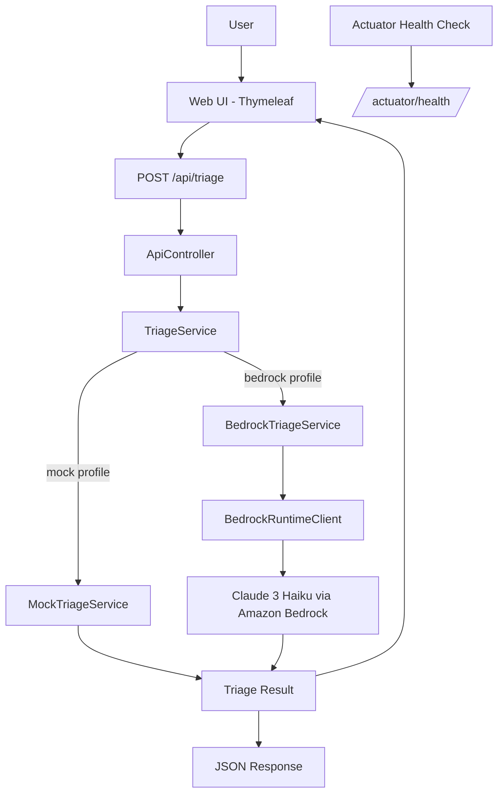

# Bedrock Triage Agent

A lightweight **Java 17 + Spring Boot 3** application that classifies support issues using **Amazon Bedrock Claude 3 Haiku**.

The app accepts free-text issue descriptions and returns:

- Category
- Severity
- Summary
- Original input text

It includes both a simple web UI and a JSON API.

---

## Features

- AI-powered issue triage using Amazon Bedrock
- Mock profile for local testing without AWS
- Web UI built with Thymeleaf
- REST API endpoint for programmatic usage
- Spring Boot Actuator health endpoint
- AWS SDK v2 integration with Bedrock Runtime
- SSO/profile-based AWS authentication support

---

## Tech Stack

| Area | Technology |
|---|---|
| Backend | Java 17, Spring Boot 3 |
| Web UI | Thymeleaf |
| API | Spring MVC REST |
| AI Service | Amazon Bedrock Claude 3 Haiku |
| AWS SDK | AWS SDK v2 |
| Monitoring | Spring Boot Actuator |
| Build Tool | Maven |

---

## Architecture



---

## Project Structure

```text
bedrock-triage-agent
├── src
│   └── main
│       ├── java
│       │   └── com.triageagent.bedrocktriageagent
│       │       ├── config
│       │       │   └── BedrockConfig.java
│       │       ├── controller
│       │       │   └── ApiController.java
│       │       ├── model
│       │       │   └── TriageResult.java
│       │       └── service
│       │           ├── TriageService.java
│       │           ├── MockTriageService.java
│       │           └── BedrockTriageService.java
│       └── resources
│           ├── templates
│           │   └── index.html
│           └── application.properties
├── pom.xml
└── README.md
```

---

## Quickstart: Run Without AWS

Use the `mock` profile to run the app locally without Amazon Bedrock access.

### Windows PowerShell

```powershell
mvn -q spring-boot:run "-Dspring-boot.run.profiles=mock"
```

### macOS / Linux

```bash
mvn -q spring-boot:run -Dspring-boot.run.profiles=mock
```

After the app starts, open:

```text
http://localhost:8080
```

---

## API Usage

The API endpoint is:

```http
POST /api/triage
```

### Example Request

```bash
curl -X POST http://localhost:8080/api/triage \
  -H "Content-Type: application/json" \
  -d '{"text":"The checkout page shows an error when I submit payment."}'
```

### Example Response

```json
{
  "text": "The checkout page shows an error when I submit payment.",
  "category": "BUG",
  "severity": "HIGH",
  "summary": "Potential defect detected; investigate logs and recent changes."
}
```

---

## Run With Amazon Bedrock

To use the real Bedrock integration, configure AWS access first.

### Prerequisites

- JDK 17+
- Maven 3.9+
- AWS CLI v2
- Access to Amazon Bedrock in your selected AWS region
- Access to the Claude 3 Haiku model
- AWS profile or SSO profile configured locally

---

## AWS Configuration

The app reads these values from `application.properties`:

```properties
app.aws.region=us-east-1
app.aws.profile=bedrock-sso
app.bedrock.modelId=anthropic.claude-3-haiku-20240307-v1:0
app.bedrock.maxTokens=512
app.bedrock.temperature=0.3
```

Example AWS SSO profile:

```ini
[profile bedrock-sso]
sso_session = my-sso
sso_account_id = 123456789012
sso_role_name = AdministratorAccess
region = us-east-1
output = json

[sso-session my-sso]
sso_start_url = https://d-xxxxxxxx.awsapps.com/start
sso_registration_scopes = sso:account:access
sso_region = us-east-1
```

Login before running the app:

```bash
aws sso login --profile bedrock-sso
```

Then start the app:

```bash
mvn -q spring-boot:run "-Dspring-boot.run.profiles=bedrock"
```

---

## Health Check

Spring Boot Actuator exposes the health endpoint:

```text
http://localhost:8080/actuator/health
```

Expected response:

```json
{
  "status": "UP"
}
```

---

## How It Works

1. The user enters an issue in the web UI.
2. The UI sends the issue text to `/api/triage`.
3. `ApiController` receives the request.
4. `TriageService` processes the issue.
5. In `mock` mode, the app returns a deterministic local response.
6. In `bedrock` mode, the app calls Amazon Bedrock Claude 3 Haiku.
7. The result is returned as structured JSON and displayed in the UI.

---

## Profiles

| Profile | Purpose |
|---|---|
| `mock` | Runs locally without AWS |
| `bedrock` | Calls Amazon Bedrock using AWS SDK v2 |

---

## License

This project is licensed under the MIT License.
